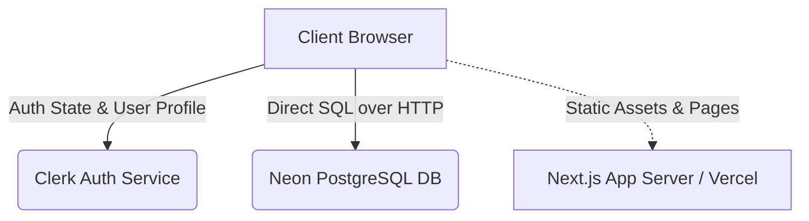
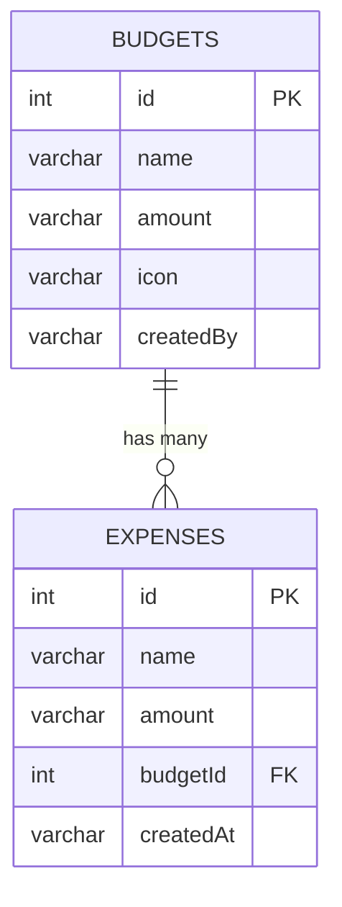

# System Design: Expense Tracker

This document describes the high-level architecture, entry points, client-server interactions, database schema, and authentication flow of the **Expense Tracker** application.

---

## 1. High-Level Architectural Overview

The Expense Tracker is built as a modern web application using **Next.js 15**, **Clerk Authentication**, and a **Neon Serverless PostgreSQL Database** queried via **Drizzle ORM**.



### Key Architectural Characteristics
- **Client-to-Database Direct Model**: The application uses Next.js Client Components (`"use client"`) to query the database directly using Drizzle ORM's HTTP-based driver (`drizzle-orm/neon-http`). Queries are resolved over a secure HTTP tunnel to the Neon Postgres instance.
- **Protected Routing**: Routing is managed through Next.js middleware using Clerk to enforce authentication on all dashboard routes.
- **Component-Driven Styling**: Built on top of **Tailwind CSS** and structured using **shadcn/ui** (Radix UI primitives).

---

## 2. Key Directory Structure & Entry Points

```
├── drizzle/                    # Database migrations generated by drizzle-kit
├── utils/                      # Database configuration & schema
│   ├── dbConfig.tsx            # Drizzle client initialization
│   └── schema.tsx              # SQL schema definitions (Budgets, Expenses)
├── src/
│   ├── middleware.ts           # Authentication & route protection entry point
│   ├── app/
│   │   ├── layout.tsx          # Root layout wrapped in ClerkProvider
│   │   ├── page.tsx            # Landing/Hero page (public)
│   │   ├── (auth)/             # Login/Sign-up routes
│   │   └── (routes)/Dashboard/ # Protected application routes
```

### Crucial Entry Points
1. **Route Guarding: `src/middleware.ts`**
   Protects all non-public routes. It checks incoming requests against the `isPublicRoute` matcher (`/`, `/sign-in`, `/sign-up`). Unauthorized requests to `/Dashboard` or its sub-paths are blocked and redirected to sign-in.
2. **Root Layout: `src/app/layout.tsx`**
   Initializes the global `<ClerkProvider>` wrapper, loading the Clerk session token and user context before the application tree renders.
3. **Application Entrance: `src/app/page.tsx`**
   Serves as the public landing page. If the user is already signed in, client-side checks in `Header.tsx` automatically redirect them to `/Dashboard`.

---

## 3. Authentication & Authorization (Clerk)

### Why Clerk?
- **Zero-Config Auth Pages**: Leverages pre-built, polished components like `<SignIn />`, `<SignUp />`, and `<UserButton />`.
- **Session Control**: Manages login status, token refresh, and user profiles securely.
- **Next.js 15 Middleware Integration**: Seamlessly hooks into the edge runtime to block unauthenticated requests.

### Authentication Flow
1. User requests a protected route like `/Dashboard`.
2. `middleware.ts` intercepts the request.
3. Clerk validates the session token.
   - If invalid, redirects the user to `/sign-in`.
   - If valid, allows the request to reach the dashboard pages.
4. On the client, `useUser()` is called to fetch the user's name, profile image, and email address (which is used as the primary identifier in the database).

---

## 4. Database Layer & Schema Design

The application utilizes **Neon PostgreSQL** (a serverless Postgres platform with scale-to-zero compute) and **Drizzle ORM** for type-safe database queries.

### Schema Structure (`utils/schema.tsx`)

#### `Budgets` Table
Holds the user's spending categories and allocations.
* `id` (`serial`, Primary Key)
* `name` (`varchar`, Not Null) - E.g., "Food", "Entertainment"
* `amount` (`varchar`, Not Null) - Target budget amount
* `icon` (`varchar`) - Selected category emoji icon
* `createdBy` (`varchar`, Not Null) - Associates the budget with the owner's Clerk email address.

#### `Expenses` Table
Holds individual transactions linked to a specific budget.
* `id` (`serial`, Primary Key)
* `name` (`varchar`, Not Null) - E.g., "Pizza lunch"
* `amount` (`varchar`, Not Null) - Transaction amount
* `budgetId` (`integer`) - Foreign Key referencing `Budgets.id` (with cascading behavior).
* `createdAt` (`varchar`, Not Null) - Timestamp of when the transaction occurred.



---

## 5. Client-to-Backend Connection Model

A unique feature of this application's architecture is its **direct-from-client database query model**. 

```
[Browser (Client Component)] 
             │
             ▼
[Drizzle Client (neon-http)] 
             │ (HTTP POST Request with SQL Query)
             ▼
[Neon HTTP Serverless Gateway]
             │
             ▼
[Neon PostgreSQL Database]
```

### How Queries Work
1. The developer configures `NEXT_PUBLIC_DATABASE_URL` in the environment variables.
2. In `utils/dbConfig.tsx`, the Neon client is initialized:
   ```typescript
   const sql = neon(process.env.NEXT_PUBLIC_DATABASE_URL as string);
   export const db = drizzle(sql, { schema });
   ```
3. Inside components (e.g. `Dashboard/page.tsx`), the DB object is imported directly:
   ```typescript
   import { db } from "../../../../utils/dbConfig";
   
   const getBudgetList = async () => {
     const result = await db.select().from(Budgets).where(eq(Budgets.createdBy, email));
     // ...
   };
   ```
4. This statement generates a SQL query payload, compiles it, and transmits it over HTTPS to Neon's API, which executes it against Postgres and returns JSON data to the client.

### Architectural Trade-offs
- **Pros**:
  - **Extreme Velocity**: Zero backend routing or controller code needs to be written. The frontend directly dictates what data it wants.
  - **No Cold Starts**: Neon's HTTP driver communicates over connectionless HTTP, eliminating TCP handshake overhead on serverless runtimes.
- **Cons/Risks**:
  - **Security Considerations**: Since `NEXT_PUBLIC_DATABASE_URL` is exposed, the database credentials are readable in the bundle. In a production system, this connection model is typically protected by Row Level Security (RLS) policies in PostgreSQL to restrict client queries to only their own data.
  - **Validation Control**: There is no server logic layer between the user inputs and the database insert operations.
